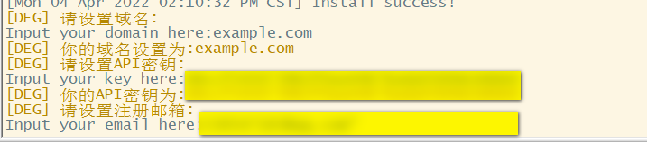

#Dulu-ui

Xray,V2ray ws,vmess,vless,trojan panel supporting multi-protocol and multi-user Full English Version

# Features

- System status monitoring
- Supports multi-user and multi-protocol, web page visual operation
- Supported protocols: vmess, vless, trojan, shadowsocks, dokodemo-door, socks, http
- Support configuring more transmission configurations
- Traffic statistics, limit traffic, limit expiration time
- Customizable xray configuration template
-Support https access panel (bring your own domain name + SSL certificate)
- Supports one-click SSL certificate application and automatic renewal
- For more advanced configuration items, see the panel for details

# Installation & Upgrade

```
bash <(curl -Ls https://raw.githubusercontent.com/dulankacharidu/Dulu-ui/master/install.sh)
```

## Manual installation & upgrade

1. First download the latest compressed package from https://github.com/dulankacharidu/Dulu-ui/releases, generally choose the `amd64` architecture
2. Then upload the compressed package to the `/root/` directory of the server, and log in to the server using the `root` user

> If your server CPU architecture is not `amd64`, replace `amd64` in the command with another architecture

```
cd /root/
rm Dulu-ui/ /usr/local/Dulu-ui/ /usr/bin/Dulu-ui -rf
tar zxvf Dulu-ui-linux-amd64.tar.gz
chmod +x Dulu-ui/Dulu-ui Dulu-ui/bin/xray-linux-* Dulu-ui/Dulu-ui.sh
cp Dulu-ui/Dulu-ui.sh /usr/bin/Dulu-ui
cp -f Dulu-ui/Dulu-ui.service /etc/systemd/system/
mv Dulu-ui/ /usr/local/
systemctl daemon-reload
systemctl enable Dulu-ui
systemctl restart Dulu-ui
```

## Install using docker

> This docker tutorial and docker image are provided by [Chasing66](https://github.com/Chasing66)

1. Install docker

```shell
curl -fsSL https://get.docker.com | sh
```

2. Install Dulu-ui

```shell
mkdir Dulu-ui && cd Dulu-ui
docker run -itd --network=host \
    -v $PWD/db/:/etc/Dulu-ui/ \
    -v $PWD/cert/:/root/cert/ \
    --name Dulu-ui --restart=unless-stopped \
    enwaiax/Dulu-ui:latest
```

> Build your own image

```shell
docker build -t Dulu-ui .
```

## SSL certificate application

> This function and tutorial are provided by [FranzKafkaYu](https://github.com/FranzKafkaYu)

The script has a built-in SSL certificate application function. To use this script to apply for a certificate, the following conditions must be met:

- Know your Cloudflare registered email address
- Know Cloudflare Global API Key
- The domain name has been resolved to the current server through cloudflare

How to obtain Cloudflare Global API Key:
    
    

When using it, you only need to enter the `domain name`, `email`, and `API KEY`. The diagram is as follows:
        

Precautions:

- This script uses DNS API for certificate request
- Use Let'sEncrypt as CA party by default
- The certificate installation directory is the /root/cert directory
- The certificates applied for by this script are all pan-domain certificates

## Use of Tg robot (under development, not available yet)
> This function and tutorial are provided by [FranzKafkaYu](https://github.com/FranzKafkaYu)

DuLu-UI supports daily traffic notification, panel login reminder and other functions through Tg robot. To use Tg robot, you need to apply by yourself.
For specific application tutorials, please refer to [blog link](https://coderfan.net/how-to-use-telegram-bot-to-alarm-you-when-someone-login-into-your-vps.html)
Instructions for use: Set robot-related parameters in the background of the panel, including

- Tg Robot Token
- Tgbot ChatId
- Tg robot cycle running time, using crontab syntax

Reference syntax:
- 30 * * * * * //Notice on the 30th second of each point
- @hourly //Notification every hour
- @daily //Notification every day (at midnight)
- @every 8h //Notification every 8 hours

TG notification content:
- Node traffic usage
- Panel login reminder
- Node expiration reminder
- Traffic warning reminder

More features are planned...
## Suggestion system

- CentOS 7+
- Ubuntu 16+
- Debian 8+

# common problem

## Migrate from v2-ui

First install the latest version of Dulu-ui on the server where v2-ui is installed, and then use the following command to migrate. All inbound account data of the local v2-ui will be migrated to Dulu-ui, and the panel settings and username and password will be migrated. Will not migrate`

> After the migration is successful, please `close v2-ui` and `restart Dulu-ui`, otherwise the inbound of v2-ui will cause a `port conflict` with the inbound of Dulu-ui`

```
Dulu-ui v2-ui
```

## issue close

All kinds of trivial questions make your blood pressure very high

## Special Thankx to : Vaxilu

